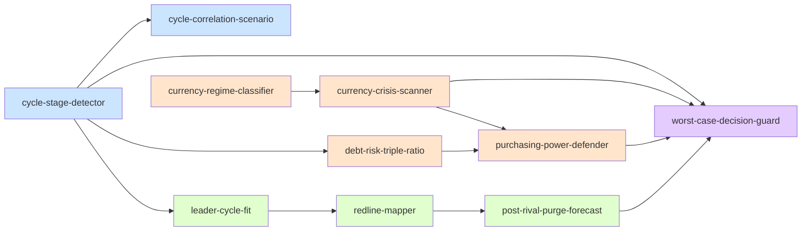

# INDEX · Skill 总览

> 本目录索引了 `principle-skill` 仓库中**全部 10 个可调用的 AI skills**,按 4 条方法论轴组织,以及它们之间的调用关系。

---

## 1. Skill 目录(全部 10)

按方法论轴分组:

### 🎯 轴 1:宏观定位(2 个)

| Slug | 中文名 | 路径 | 触发关键词 |
|------|--------|------|-----------|
| `cycle-stage-detector` | 周期阶段检测器 | [`./cycle-stage-detector/SKILL.md`](./cycle-stage-detector/SKILL.md) | "周期哪个阶段"/"是不是顶部"/"X 国像历史何时" |
| `cycle-correlation-scenario` | 三周期交叉推演器 | [`./cycle-correlation-scenario/SKILL.md`](./cycle-correlation-scenario/SKILL.md) | "三周期叠加"/"最坏情景"/"10 年推演" |

### 💰 轴 2:货币金融(4 个)

| Slug | 中文名 | 路径 | 触发关键词 |
|------|--------|------|-----------|
| `debt-risk-triple-ratio` | 债务风险三维比率 | [`./debt-risk-triple-ratio/SKILL.md`](./debt-risk-triple-ratio/SKILL.md) | "债能不能借"/"国债危险"/"加杠杆" |
| `currency-regime-classifier` | 货币体系分类器 | [`./currency-regime-classifier/SKILL.md`](./currency-regime-classifier/SKILL.md) | "什么货币体系"/"会不会像魏玛"/"货币信心" |
| `currency-crisis-scanner` | 货币危机信号扫描器 | [`./currency-crisis-scanner/SKILL.md`](./currency-crisis-scanner/SKILL.md) | "贬值螺旋开始了吗"/"资本外逃"/"央行印钞多危险" |
| `purchasing-power-defender` | 购买力防御器 | [`./purchasing-power-defender/SKILL.md`](./purchasing-power-defender/SKILL.md) | "钱缩水""买黄金""世界末日组合" |

### 🌐 轴 3:地缘制度(3 个)

| Slug | 中文名 | 路径 | 触发关键词 |
|------|--------|------|-----------|
| `leader-cycle-fit` | 领导力-周期匹配度 | [`./leader-cycle-fit/SKILL.md`](./leader-cycle-fit/SKILL.md) | "阶段需要什么领袖"/"制度能力评估" |
| `redline-mapper` | 地缘底线映射器 | [`./redline-mapper/SKILL.md`](./redline-mapper/SKILL.md) | "他们底线"/"为啥而战"/"可交换的筹码" |
| `post-rival-purge-forecast` | 战后权力洗牌预测器 | [`./post-rival-purge-forecast/SKILL.md`](./post-rival-purge-forecast/SKILL.md) | "共同敌人倒下后"/"联盟会不会散"/"清洗" |

### 🛡️ 轴 4:决策保护(1 个)

| Slug | 中文名 | 路径 | 触发关键词 |
|------|--------|------|-----------|
| `worst-case-decision-guard` | 最坏情况决策保护器 | [`./worst-case-decision-guard/SKILL.md`](./worst-case-decision-guard/SKILL.md) | "最坏会怎样"/"我不敢决定"/"决策底线" |

---

## 2. 调用关系全景



**调用方向总览**:
- **宏观定位** 是入口(周期信息被其他轴消费)
- **货币金融** 是落地(消费周期信号,产出行动方案)
- **地缘制度** 是横切(可不依赖定位独立工作)
- **决策保护** 是终点(任何风险评估后的最后一步)

---

## 3. 决策流程:用户问什么 → 用哪个 Skill

```
                       用户提问
                          │
        ┌─────────────────┼─────────────────────┐
        │                 │                     │
        ▼                 ▼                     ▼
  "我在哪/           "风险评估/            "决策/怎么做/
   像历史上谁"        信号扫描"            行动方案"
        │                 │                     │
        ▼                 ▼                     ▼
  ─────轴 1────    ─────轴 2/3────      ────轴 4────
  cycle-stage-     debt-risk-           worst-case-
   detector         triple-ratio         decision-guard
  cycle-           currency-            purchasing-
   correlation-     regime-classifier    power-defender
   scenario        currency-            redline-mapper
                   crisis-scanner       post-rival-purge-
                   leader-cycle-fit      forecast
```

### 典型用户场景 → 调用组合

| 场景 | 调用顺序 |
|------|---------|
| **"我要不要换美元 / 美债?"** | `cycle-stage-detector` → `currency-regime-classifier` → `debt-risk-triple-ratio` → `worst-case-decision-guard` |
| **"我的房贷会不会爆?"** | `debt-risk-triple-ratio` → `worst-case-decision-guard`(若决定保留/出售) |
| **"X 国会不会违约?"** | `cycle-stage-detector` → `debt-risk-triple-ratio` |
| **"我们要不要辞职创业?"** | `worst-case-decision-guard`(直接)+ `purchasing-power-defender`(评估资产安全) |
| **"美国会陷入内战吗?"** | `cycle-stage-detector` → `leader-cycle-fit`(评国家制度而非个人) → `worst-case-decision-guard` |
| **"中美的真正底线在哪?"** | `redline-mapper`(直接)+ `post-rival-purge-forecast`(若共敌场景) |
| **"未来 5-10 年我的资产怎么办?"** | `cycle-correlation-scenario` → `purchasing-power-defender` |
| **"现在的通胀怎么抗?"** | `currency-crisis-scanner` → `purchasing-power-defender` |

---

## 4. Skill 间的引用关系矩阵

| Skill A | depends-on | contrasts-with | composes-with |
|---------|-----------|----------------|---------------|
| `cycle-stage-detector` | — | `worst-case-decision-guard`, `currency-crisis-scanner` | 几乎所有其他 skill(提供阶段输入) |
| `cycle-correlation-scenario` | `cycle-stage-detector`(周期位置) | `cycle-stage-detector`(单坐标 vs 多情景) | `currency-crisis-scanner`, `worst-case-decision-guard` |
| `debt-risk-triple-ratio` | — | `cycle-stage-detector`(微观 vs 宏观) | `currency-regime-classifier`, `purchasing-power-defender` |
| `currency-regime-classifier` | — | `currency-crisis-scanner`(分类 vs 扫描) | `debt-risk-triple-ratio`, `currency-crisis-scanner` |
| `currency-crisis-scanner` | `currency-regime-classifier`(体系分类) | `debt-risk-triple-ratio`(单点 vs 综合) | `purchasing-power-defender` |
| `purchasing-power-defender` | `currency-crisis-scanner`(风险输入) | `worst-case-decision-guard`(配置 vs 决策) | `debt-risk-triple-ratio` |
| `leader-cycle-fit` | `cycle-stage-detector`(阶段输入) | `cycle-stage-detector`(纵向诊断 vs 横向评估) | `redline-mapper` |
| `redline-mapper` | — | `worst-case-decision-guard`(客观 vs 主观) | `post-rival-purge-forecast` |
| `post-rival-purge-forecast` | `redline-mapper`(利益结构) | `cycle-correlation-scenario`(单事件 vs 多情景) | `worst-case-decision-guard` |
| `worst-case-decision-guard` | — | 几乎所有(终点) | 几乎所有(下游消费) |

---

## 5. Skill 与达利欧原则的映射

| 原则出处 | 对应 Skill |
|---------|-----------|
| **"螺旋上行 + 6 阶段"** | `cycle-stage-detector` |
| **"一组特定情况创造有限可能性"** | `cycle-stage-detector`, `cycle-correlation-scenario` |
| **三维比率(债务/硬通货、债务/现金流、利息 vs 贬值)** | `debt-risk-triple-ratio` |
| **"债务增速 > 现金流增速 = 泡沫"** | `debt-risk-triple-ratio`(现金流维度) |
| **三类型货币体系(硬/纸/法币)** | `currency-regime-classifier` |
| **"央行利率不能下调 → 印钞贬值"** | `currency-crisis-scanner`(信号 1) |
| **"金融财富需兑换为实物财富才有价值"** | `currency-crisis-scanner`(信号 5) |
| **"实物 vs 金融财富"** | `purchasing-power-defender`(实物层) |
| **"投资 = 储存购买力,必须考虑通胀"** | `purchasing-power-defender`(贯穿), `debt-risk-triple-ratio`(利息维度) |
| **"防淘汰 > 求高收益"** | `worst-case-decision-guard`(核心) |
| **"互不相关的下注降低 80% 风险"** | `worst-case-decision-guard`(分散步骤), `purchasing-power-defender`(分散层) |
| **"与最聪明的人反复沟通"** | `worst-case-decision-guard`(压力测试) |
| **"权力平衡 → 清洗"** | `post-rival-purge-forecast`(核心) |
| **"知道对手为何而战"** | `redline-mapper`(核心) |
| **"励志将领 vs 土木工程师"** | `leader-cycle-fit`(核心) |
| **"分散效应:全球比单国平滑"** | `cycle-correlation-scenario`(剪枝依据) |

---

## 6. 质量验证状态

| Skill | V1 跨域 | V2 预测力 | V3 独特性 | 字数 | 风险等级 |
|-------|--------|----------|----------|------|---------|
| `cycle-stage-detector` | ✅ | ✅ | ✅ | ~1480 | 低 |
| `cycle-correlation-scenario` | ✅ | ✅ | ✅ | ~1450 | 中(情景推演精度有限) |
| `debt-risk-triple-ratio` | ✅ | ✅ | ✅ | ~2365 | 低 |
| `currency-regime-classifier` | ✅ | ✅ | ✅ | ~1380 | 低 |
| `currency-crisis-scanner` | ✅ | ✅ | ✅ | ~1380 | 中(信心信号难量化) |
| `purchasing-power-defender` | ✅ | ✅ | ✅ | ~1859 | 低 |
| `leader-cycle-fit` | ✅ | ✅ | ✅ | ~1700 | **高**(政治化风险) |
| `redline-mapper` | ✅ | ✅ | ✅ | ~1500 | 低 |
| `post-rival-purge-forecast` | ✅ | ✅ | ✅ | ~1450 | 低 |
| `worst-case-decision-guard` | ✅ | ✅ | ✅ | ~1500 | 低 |

V1 = 跨章节佐证(书中 ≥2 个独立段落); V2 = 预测力(能回答书里没明说的新问题); V3 = 独特性(非普通常识)。

---

## 7. 更新日志

### v1.3.0 (2026-07-11) — 撤回 darwin 套件
- 全部 10 个 `test-prompts.json` 已移除
- 保留 SKILL.md 中的 A2 触发场景段作为轻量级"小鸡测试"
- 详细说明见 README.md

### v1.2.0 (2026-07-11) — 已撤回
- darwin 压力测试套件曾补全:10/10 skills 的 test-prompts.json(共 156+ 条用例)
- debt-risk-triple-ratio type/id bug 已修复

### v1.1.0 (2026-07-11) — 数据源接入 + darwin 试点
**新增资源**:
- **[DATA_SOURCES.md](./DATA_SOURCES.md)** — ~30 个权威数据源速查表(API 优先)
- 每个 SKILL.md 新增 `## 数据源指引 (Data Sources)` 段,指明本 skill 必查的数据源

**本批数据源优先级**:
- 货币金融: World Bank IDS / FRED M2+TIPS / BIS REER / 黄金价格
- 地缘制度: V-Dem / Polity V / WGI / SIPRI / UCDP
- 宏经对比: World Bank Open Data / IMF WEO / OECD

### v1.0.0 (2026-07-11) — 完整 10 skill 首发
**新增**:
- `cycle-stage-detector` — P0 基础定位
- `debt-risk-triple-ratio` — P0 风险量化
- `worst-case-decision-guard` — P0 决策保护
- `redline-mapper` — P1 地缘底线
- `currency-regime-classifier` — P2 货币体系
- `currency-crisis-scanner` — P2 危机扫描
- `purchasing-power-defender` — P2 购买力防御
- `cycle-correlation-scenario` — P3 跨周期推演
- `leader-cycle-fit` — P3 制度匹配度(政治化风险标记)
- `post-rival-purge-forecast` — P3 战后洗牌

**基础设施**:
- README.md:4 轴分组 + 调用图 + 触发词示例
- INDEX.md:本索引
- LICENSE:MIT + 书源致谢
- .gitignore:标准忽略规则

### v0.1.0 (2026-07-11) — P0 三件套首发
- `cycle-stage-detector`
- `debt-risk-triple-ratio`
- `worst-case-decision-guard`