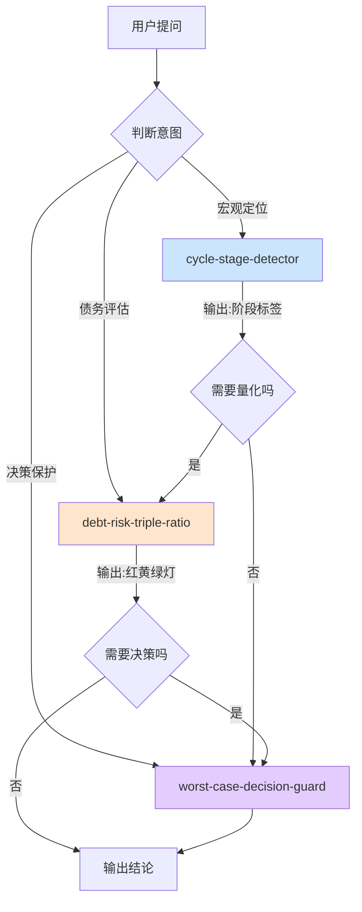

# INDEX · Skill 总览

> 本目录索引了 `principle-skill` 仓库中所有可用的 AI skills,以及它们之间的调用关系。

---

## Skill 目录

| Slug | 中文名 | 路径 | 触发关键词 | 优先级 |
|------|--------|------|-----------|--------|
| `cycle-stage-detector` | 周期阶段检测器 | [`./cycle-stage-detector/SKILL.md`](./cycle-stage-detector/SKILL.md) | "周期哪个阶段"/"是不是顶部"/"X 国像历史何时" | P0 |
| `debt-risk-triple-ratio` | 债务风险三维比率 | [`./debt-risk-triple-ratio/SKILL.md`](./debt-risk-triple-ratio/SKILL.md) | "债能不能借"/"国债危险"/"加杠杆" | P0 |
| `worst-case-decision-guard` | 最坏情况决策保护器 | [`./worst-case-decision-guard/SKILL.md`](./worst-case-decision-guard/SKILL.md) | "最坏会怎样"/"我不敢决定"/"决策底线" | P0 |

---

## 调用关系图



### 单 Skill 输入/输出对照

| Skill | 主要输入 | 主要输出 |
|-------|---------|---------|
| `cycle-stage-detector` | 国家/行业名 + 五大信号数据 | 阶段标签 + 5 信号灯 + 历史类比 |
| `debt-risk-triple-ratio` | 债务/硬通货、债务/现金流、利率 vs 贬值 三组数据 | 红黄绿灯评级 + 行动方案 |
| `worst-case-decision-guard` | 决策描述 + 用户可承受底线 | 决策树 + 防淘汰方案 + 压力测试名单 |

---

## 决策流程:用户问什么 → 用哪个 Skill

```
                    ┌──────────────────────────────────┐
                    │  用户的提问方向是什么?            │
                    └──────────────────┬───────────────┘
                                       │
       ┌───────────────────┬───────────┼───────────┬───────────────────┐
       │                   │           │           │                   │
       ▼                   ▼           ▼           ▼                   ▼
  "我在哪/         "这笔债/       "该怎么办/    "X 国像谁/        其他
   像历史上谁"      投资安不安全"  风险太大"     历史会重演吗"
       │                   │           │           │                   │
       ▼                   ▼           ▼           ▼                   ▼
  cycle-stage-      debt-risk-   worst-case-  cycle-stage-       (无明确匹配,
  detector          triple-ratio decision-guard detector          返回 ask)
```

### 典型组合调用

| 场景 | 调用顺序 |
|------|---------|
| "我该不该现在换美元?" | `cycle-stage-detector` (定位美元周期) → `debt-risk-triple-ratio` (评估美债) → `worst-case-decision-guard` (决策) |
| "我要不要辞职创业?" | `worst-case-decision-guard` (直接决策框架,可能引用周期定位做背景) |
| "X 国会不会违约?" | `cycle-stage-detector` (定位阶段) → `debt-risk-triple-ratio` (三维评估) |
| "我的房贷会不会爆?" | `debt-risk-triple-ratio` (直接评估) → `worst-case-decision-guard` (若决定是否要继续持有) |

---

## Skill 之间的引用关系

| Skill A | depends-on | contrasts-with | composes-with |
|---------|-----------|----------------|---------------|
| `cycle-stage-detector` | - | `worst-case-decision-guard`(定位 vs 决策) | `debt-risk-triple-ratio`(用阶段作为输入) |
| `debt-risk-triple-ratio` | - | `cycle-stage-detector`(微观风险 vs 宏观定位) | `cycle-stage-detector`, `worst-case-decision-guard` |
| `worst-case-decision-guard` | - | `debt-risk-triple-ratio`(过程 vs 量化) | 所有其他 skill(可作为下游) |

---

## Skill 与达利欧原则的映射

| 原则 | 对应 Skill |
|------|-----------|
| **螺旋上行 + 6 阶段** | `cycle-stage-detector` |
| **"一组特定情况创造有限可能性"** | `cycle-stage-detector`(历史类比) |
| **三维比率(债务/硬通货、债务/现金流、利息 vs 贬值)** | `debt-risk-triple-ratio` |
| **"债务增速 > 现金流增速 = 泡沫"** | `debt-risk-triple-ratio`(现金流维度) |
| **"投资 = 储存购买力,必须考虑通胀"** | `debt-risk-triple-ratio`(利息维度) |
| **"防淘汰 > 求高收益"** | `worst-case-decision-guard`(四步法核心) |
| **"互不相关的下注降低 80% 风险"** | `worst-case-decision-guard`(分散步骤) |
| **"与最聪明的人反复沟通"** | `worst-case-decision-guard`(压力测试) |

---

## 质量验证状态

| Skill | V1 跨域 | V2 预测力 | V3 独特性 | 总长度 | 来源章节 |
|-------|--------|----------|----------|--------|----------|
| `cycle-stage-detector` | ✅ | ✅ | ✅ | ~1480 字 | 第 31/33/37/44/45 章 |
| `debt-risk-triple-ratio` | ✅ | ✅ | ✅ | ~2365 字 | 第 3/4/7 章 |
| `worst-case-decision-guard` | ✅ | ✅ | ✅ | ~1500 字 | 第 51 章 |

V1 = 跨章节佐证(书中 ≥2 个独立段落); V2 = 预测力(能回答书里没明说的新问题); V3 = 独特性(非普通常识)。

---

## 更新日志

- **2026-07-11** v0.1.0 — P0 三件套首次发布
  - `cycle-stage-detector`
  - `debt-risk-triple-ratio`
  - `worst-case-decision-guard`